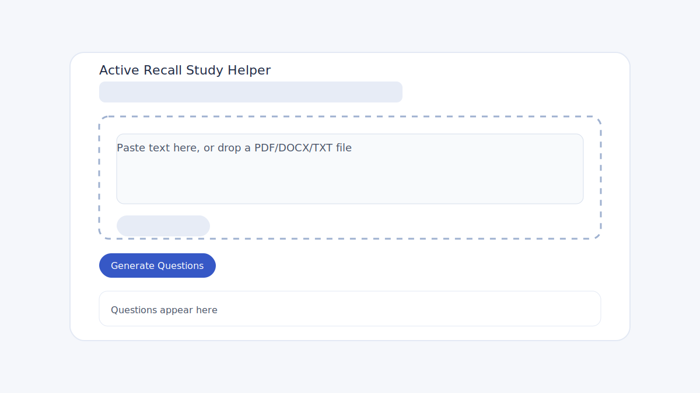

# Active Recall Study Helper

Turn reading into recall practice. This is a static HTML/CSS/Vanilla JS site with an Express backend that calls an LLM to generate 5-15 active-recall questions from pasted text or uploaded files.

## What it does
- Paste text or drag-and-drop PDF, DOCX, or TXT into a single input area.
- Extracts text in the browser and sends it to the backend.
- The backend asks an LLM to return a clean array of questions.
- Questions render in a simple list with clear status feedback.

## Tech stack
- Frontend: HTML, CSS, Vanilla JS
- Backend: Node.js + Express
- LLM: OpenAI Chat Completions API
- File parsing: PDF.js and Mammoth.js (loaded via CDN)

## How it works
1. The user pastes text or drops a file.
2. The browser extracts text (TXT/PDF/DOCX).
3. The client sends the text to `POST /api/questions`.
4. The server calls the LLM with a JSON schema response format.
5. The client renders the questions list.

## Running locally
1. Install dependencies:
   - `npm install`
2. Create an env file:
   - `cp .env.example .env`
   - Set `OPENAI_API_KEY=...`
3. Start the server:
   - `npm run dev` (auto-restarts)
   - or `npm start`
4. Open `http://localhost:3000`

## API
- `POST /api/questions`
  - Body: `{ "text": "..." }`
  - Response: `{ "questions": ["...", "..."] }`

## Notes
- The UI is served from the Express server so the client can call `/api/questions`.
- `.env` is ignored by git; use `.env.example` as a template.

## Nice to have (future)
- Better error messages for unsupported PDFs (scanned images).
- Question types (short answer vs. multi-step).
- Export questions to PDF or flashcards.
- Basic word count and summary preview before generation.